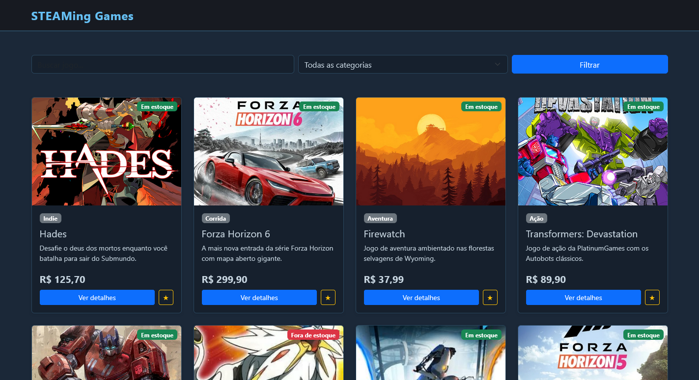
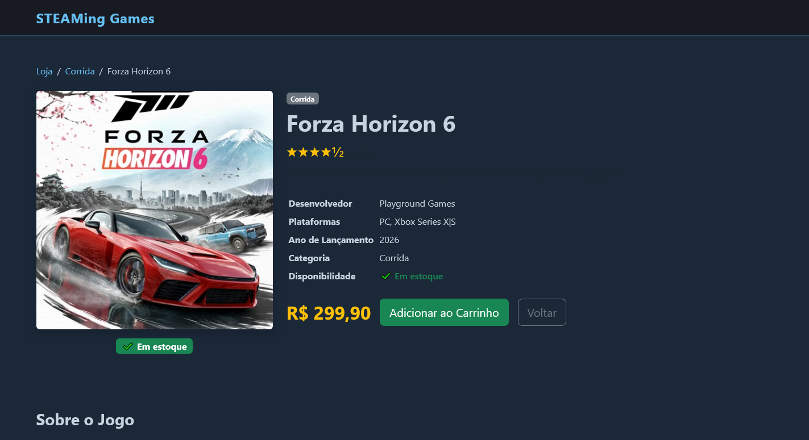

# Trabalho Prático - Semana 11

Nesta atividade, vamos evoluir o projeto em que estamos trabalhando nesse semestre, acrescentando a página de detalhes.

Imagine que a página principal (home-page) mostre um visão dos vários itens que existem no seu site. Ao clicar em um item, você é direcionado pra a página de detalhes. A página de detalhe vai mostrar todas as informações sobre o item do seu projeto, seja esse item uma notícia, filme, receita, lugar turístico ou evento.

## Informações Gerais

- Nome: Rafael Eustáquio Maia Reis
- Matricula: 927756
- Loja de jogos (somente meus favoritos por enquanto)

## Prints do trabalho




## Dados em JSON
Inclua aqui a estrutura de dados definida por você para o projeto com pelo menos dois exemplo de dados.

```json
"produtos":
    {
      "id": 1,
      "nome": "Hades",
      "preco": 125.70,
      "categoria": "Indie",
      "imagem": "https://cdn1.epicgames.com/min/offer/1200x1600-1200x1600-e92fa6b99bb20c9edee19c361b8853b9.jpg",
      "descricao": "Desafie o deus dos mortos enquanto você batalha para sair do Submundo.",
      "conteudo": "Hades é um jogo roguelike de ação desenvolvido pela Supergiant Games. Você joga como Zagreus, filho imortal do deus Hades, tentando escapar do Submundo com a ajuda dos deuses do Olimpo. Cada tentativa de fuga melhora suas habilidades e desvenda novos segredos da narrativa. Com um sistema de combate fluido, progressão envolvente e diálogos cheios de personalidade, Hades conquistou inúmeros prêmios e se tornou um dos maiores destaques do gênero.",
      "desenvolvedor": "Supergiant Games",
      "plataforma": "PC, PS4, PS5, Xbox, Switch",
      "anoLancamento": 2020,
      "avaliacao": 9.5,
      "emEstoque": true
    },
    {
      "id": 2,
      "nome": "Forza Horizon 6",
      "preco": 299.90,
      "categoria": "Corrida",
      "imagem": "https://upload.wikimedia.org/wikipedia/pt/0/03/Forza_Horizon_6.jpg",
      "descricao": "A mais nova entrada da série Forza Horizon com mapa aberto gigante.",
      "conteudo": "Forza Horizon 6 é o mais recente capítulo da aclamada franquia de corrida da Microsoft. Com um mapa aberto imenso e detalhado, mais de 600 carros licenciados e um ciclo climático dinâmico, o jogo oferece uma das experiências de direção mais completas já vistas nos videogames. Explore cada centímetro do mapa, compita online com amigos ou enfrente os desafios solo no modo carreira repleto de eventos e personalizações.",
      "desenvolvedor": "Playground Games",
      "plataforma": "PC, Xbox Series X|S",
      "anoLancamento": 2026,
      "avaliacao": 9.2,
      "emEstoque": true
    },
```


